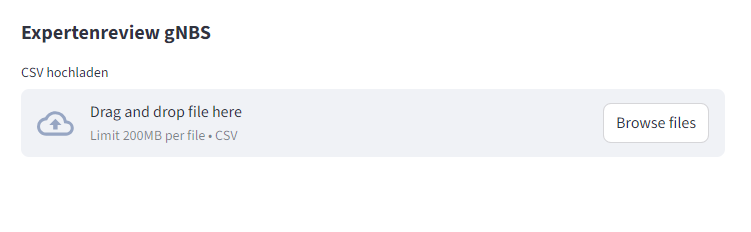
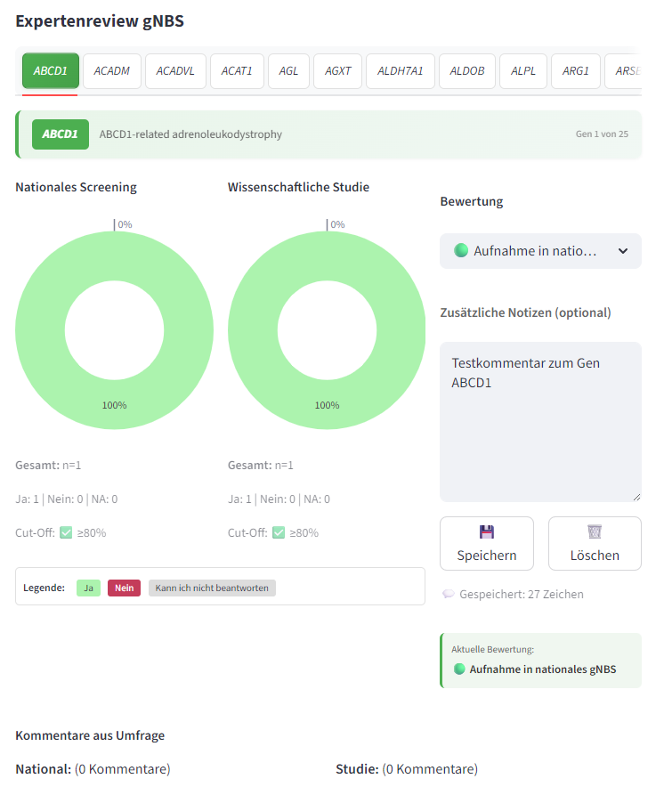
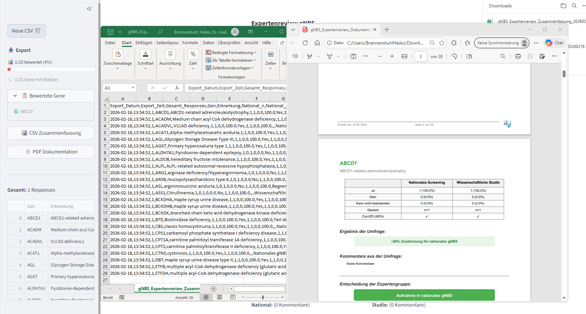

# Expertenreview gNBS App

Eine interaktive Streamlit-Anwendung zur strukturierten Bewertung von Gen-Erkrankungs-Kombinationen für das genomische Neugeborenenscreening (gNBS) im Rahmen eines modifizierten Delphi-Prozesses.

## 📋 Inhaltsverzeichnis

- [Übersicht](#übersicht)
- [Features](#features)
- [Installation](#installation)
- [Verwendung](#verwendung)
- [Delphi-Prozess](#delphi-prozess)
- [Export und Dokumentation](#export-und-dokumentation)
- [Technische Details](#technische-details)
- [Beitragen](#beitragen)
- [Lizenz](#lizenz)

## 🎯 Übersicht

Diese App unterstützt Expertengruppen bei der systematischen Bewertung von Genen für das genomische Neugeborenenscreening. Sie ermöglicht:

- **Import** von LimeSurvey-Umfrageergebnissen (CSV)
- **Visualisierung** der Umfrageergebnisse mit interaktiven Diagrammen
- **Strukturierte Bewertung** durch Dropdown-Menü
- **Dokumentation** von Entscheidungen und Abweichungen
- **Export** als PDF (vollständige Dokumentation) und CSV (Datenanalyse)

## ✨ Features

### 1. CSV-Import
- Automatisches Einlesen von LimeSurvey-Exporten
- Erkennung von Gen-Erkrankungs-Kombinationen
- Robustes Parsing (unterstützt Non-Breaking Spaces und verschiedene Encodings)

### 2. Interaktive Visualisierung
- **Pie Charts** für jedes Gen (National vs. Wissenschaftliche Studie)
- Prozentuale und absolute Zahlen
- Cut-off Visualisierung (≥80% Zustimmung)
- Kommentare aus der Umfrage

### 3. Strukturierte Bewertung
**Dropdown-Menü mit 4 Optionen:**
- 🟢 Aufnahme in nationales gNBS
- 🟡 Aufnahme in wissenschaftliche gNBS Studie
- 🔴 Keine Berücksichtigung im gNBS
- ⚪ Weitere Diskussion erforderlich

**Optional:** Zusätzliche Freitext-Notizen

### 4. Navigation
- **Tab-Navigation** durch alle Gene
- **Tastatur-Shortcuts**: ⬅️ ➡️ Pfeiltasten zum schnellen Durchklicken
- **Fortschrittsanzeige** in der Sidebar
- **Kursive Gen-Namen** (wissenschaftliche Konvention)

### 5. Export-Funktionen

#### PDF-Export (Dokumentation)
Vollständige Dokumentation mit:
- Titelseite mit Metadaten
- Automatisches Inhaltsverzeichnis
- **Pro Gen eine Seite:**
  - Statistik-Tabelle (Ja/Nein/NA für National & Studie)
  - Umfrage-Ergebnis (farbcodiert)
  - Kommentare aus der Umfrage
  - Entscheidung der Expertengruppe (prominent)
  - Zusätzliche Notizen
- Versions- und Repository-Information

#### CSV-Export (Datenanalyse)
Strukturiert für wissenschaftliche Publikationen:
- Metadaten (Datum, Zeit, Teilnehmerzahl)
- Vollständige Umfrageergebnisse (absolut & prozentual)
- Automatische Empfehlung (basierend auf ≥80% Cut-off)
- Expertengruppen-Entscheidung
- **Abweichungs-Analyse** (zeigt Diskrepanzen zwischen Umfrage und Expertenmeinung)
- Qualitative Kommentare

## 🚀 Installation

### Voraussetzungen
- Python 3.8 oder höher
- pip

### Schritt-für-Schritt Installation

1. **Repository klonen:**
```bash
git clone https://github.com/HeikoBre/screening-dashboard-sandbox.git
cd screening-dashboard-sandbox
```

2. **Virtuelle Umgebung erstellen (empfohlen):**
```bash
python -m venv venv
source venv/bin/activate  # Linux/Mac
venv\Scripts\activate     # Windows
```

3. **Abhängigkeiten installieren:**
```bash
pip install -r requirements.txt
```

4. **App starten:**
```bash
streamlit run app.py
```

Die App öffnet sich automatisch im Browser unter `http://localhost:8501`

## 📖 Verwendung

### 1. CSV hochladen



1. Klicken Sie auf "CSV hochladen"
2. Wählen Sie Ihren LimeSurvey-Export aus
3. Die App analysiert automatisch alle Gen-Erkrankungs-Kombinationen

**Erwartetes CSV-Format:**
- LimeSurvey-Export mit Standard-Spaltennamen
- Spalten müssen enthalten: `Gen: [GENNAME]` und `Erkrankung: [KRANKHEIT]`
- Unterscheidung zwischen "nationalen" und "wissenschaftlicher" Studie

### 2. Gene bewerten



**Für jedes Gen:**

1. **Visualisierung prüfen:**
   - Linke Seite: Umfrageergebnisse National
   - Rechte Seite: Umfrageergebnisse Studie
   - Automatische Cut-off-Anzeige (✅ ≥80% oder ❌ <80%)

2. **Entscheidung treffen:**
   - Dropdown-Menü: Wählen Sie eine der 4 Empfehlungen
   - Die Auswahl wird automatisch gespeichert

3. **Optional: Notizen hinzufügen:**
   - Textfeld für Begründungen, Diskussionspunkte, Vorbehalte
   - Klick auf "💾 Speichern"

4. **Nächstes Gen:**
   - Klick auf nächsten Tab ODER
   - Drücken Sie ➡️ (Pfeiltaste rechts)

### 3. Fortschritt verfolgen


**Sidebar zeigt:**
- Fortschrittsbalken (bewertete Gene)
- Anzahl Gene mit Notizen
- Liste der bewerteten Gene (aufklappbar)

### 4. Exportieren



**PDF-Dokumentation:**
- Vollständiger Bericht für Archivierung
- Enthält alle Visualisierungen und Entscheidungen
- Geeignet für: Interne Dokumentation, Aktenablage

**CSV-Datenexport:**
- Strukturierte Daten für statistische Analyse
- Enthält Abweichungs-Analyse
- Geeignet für: Publikationen, Supplement-Material, weitere Analysen

## 🔄 Delphi-Prozess

Die App unterstützt einen modifizierten Delphi-Prozess:

### Runde 1: Umfrage (vor der Besprechung)
- LimeSurvey-Umfrage unter Experten
- Zwei Fragen pro Gen:
  1. Eignung für **nationales** gNBS?
  2. Eignung für **wissenschaftliche Studie**?
- Antworten: Ja / Nein / Kann nicht beantworten
- Optional: Kommentare

### Runde 2: Expertenbesprechung (in der App)
- Gemeinsame Sichtung der Umfrageergebnisse
- Diskussion von Grenzfällen
- **Konsensus-Entscheidung** via Dropdown
- Dokumentation von Abweichungen

### Output: Transparente Dokumentation
Der CSV-Export zeigt explizit:
- Was die **Umfrage** ergab (≥80% Cut-off)
- Was die **Expertengruppe** entschied
- **Abweichungen** und deren Begründungen

## 📤 Export und Dokumentation

### PDF-Struktur

```
📄 Expertenreview gNBS Dokumentation
│
├─ 📑 Seite 1: Titelseite
│   ├─ Datum
│   ├─ Anzahl Responses
│   └─ Anzahl Gene
│
├─ 📑 Seite 2: Inhaltsverzeichnis
│   └─ Alle Gene mit Seitenzahlen
│
├─ 📑 Seite 3-27: Gen-Seiten (eine pro Gen)
│   ├─ Statistik-Tabelle
│   ├─ 📊 Umfrage-Ergebnis
│   ├─ 💬 Kommentare aus Umfrage
│   ├─ ─────────────────
│   ├─ ✅ Expertengruppen-Entscheidung
│   └─ 📝 Zusätzliche Notizen
│
└─ 📑 Letzte Seite: Versions-Info
    ├─ App-Version
    ├─ Erstellungsdatum
    └─ GitHub Repository
```

### CSV-Spalten

| Kategorie | Spalten | Beschreibung |
|-----------|---------|--------------|
| **Metadaten** | Export_Datum, Export_Zeit, Gesamt_Responses | Wann und mit wie vielen Teilnehmern |
| **Gen-Info** | Gen, Erkrankung | Gen-Name (kursiv) und Krankheit |
| **Umfrage National** | National_n, National_Ja_n, National_Nein_n, National_NA_n, National_Ja_pct, National_80 | Vollständige Statistik |
| **Umfrage Studie** | Studie_n, Studie_Ja_n, Studie_Nein_n, Studie_NA_n, Studie_Ja_pct | Vollständige Statistik |
| **Kommentare** | Kommentare_National, Kommentare_Studie | Qualitative Daten |
| **Delphi-Prozess** | Umfrage_Empfehlung, Expertengruppe_Entscheidung | Vorher/Nachher |
| **Abweichungen** | Abweichung_von_Umfrage, Abweichung_Details | Wo weicht Expertenmeinung ab? |
| **Notizen** | Expertengruppe_Notizen | Freitext-Begründungen |

## 🔧 Technische Details

### Architektur
- **Framework:** Streamlit 1.28+
- **Datenverarbeitung:** Pandas
- **Visualisierung:** Plotly
- **PDF-Generierung:** ReportLab
- **Version Control:** Git

### Datenschutz
- **Keine Cloud-Speicherung:** Alle Daten bleiben lokal
- **Session-basiert:** Daten werden nicht persistent gespeichert
- **Export-Kontrolle:** Nutzer entscheidet was exportiert wird

### Browser-Kompatibilität
- ✅ Chrome/Edge (empfohlen)
- ✅ Firefox
- ✅ Safari

### Bekannte Limitationen
- CSV muss LimeSurvey-Standardformat entsprechen
- Maximale Anzahl Gene: ~100 (Performance)
- PDF-Größe wächst linear mit Anzahl Gene und Kommentaren

## 🐛 Troubleshooting

### Problem: Gene werden nicht erkannt
**Lösung:** Prüfen Sie die Spaltennamen in Ihrer CSV:
- Müssen enthalten: `Gen: [NAME]` und `Erkrankung: [KRANKHEIT]`
- Achten Sie auf "nationalen" vs "nationale" (Schreibweise)

### Problem: PDF-Generierung schlägt fehl
**Lösung:** 
- Prüfen Sie freien Speicherplatz
- Große Kommentare können Probleme verursachen
- Probieren Sie zuerst den CSV-Export

### Problem: Tastatur-Navigation funktioniert nicht
**Lösung:**
- Klicken Sie außerhalb von Textfeldern
- Navigation ist deaktiviert während der Texteingabe

## 🤝 Beitragen

Beiträge sind willkommen! Bitte:

1. Forken Sie das Repository
2. Erstellen Sie einen Feature-Branch (`git checkout -b feature/AmazingFeature`)
3. Committen Sie Ihre Änderungen (`git commit -m 'Add some AmazingFeature'`)
4. Pushen Sie den Branch (`git push origin feature/AmazingFeature`)
5. Öffnen Sie einen Pull Request

## 📝 Changelog

### Version 1.0.0 (2026)
- ✨ Initiales Release
- 📊 CSV-Import von LimeSurvey
- 🎨 Interaktive Visualisierung
- ✅ Dropdown-Bewertung
- 📄 PDF & CSV Export
- ⌨️ Tastatur-Navigation
- 🔄 Vollständige Delphi-Dokumentation

## 📄 Lizenz

[Apache License, Version 2.0](https://www.apache.org/licenses/LICENSE-2.0)

## 👥 Autoren & Danksagungen

- **Entwicklung & Konzept:** Heiko Brennenstuhl

## 📞 Kontakt

Bei Fragen oder Problemen:
- **GitHub Issues:** [Issue erstellen](https://github.com/HeikoBre/screening-dashboard-sandbox/issues)
- **E-Mail:** heiko.brennenstuhl@med.uni-heidelberg.de

## 🔗 Weiterführende Links

- [LimeSurvey Documentation](https://manual.limesurvey.org/)
- [Streamlit Documentation](https://docs.streamlit.io/)
- [Delphi-Methode](https://de.wikipedia.org/wiki/Delphi-Methode)

---

**Hinweis:** Diese App wurde für wissenschaftliche Zwecke entwickelt. Für medizinische Entscheidungen konsultieren Sie bitte Fachpersonal.

*Zuletzt aktualisiert: Februar 2026*
